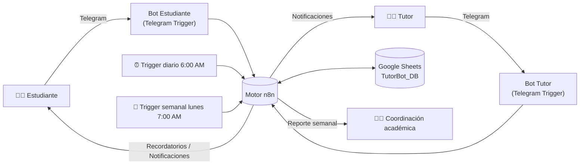
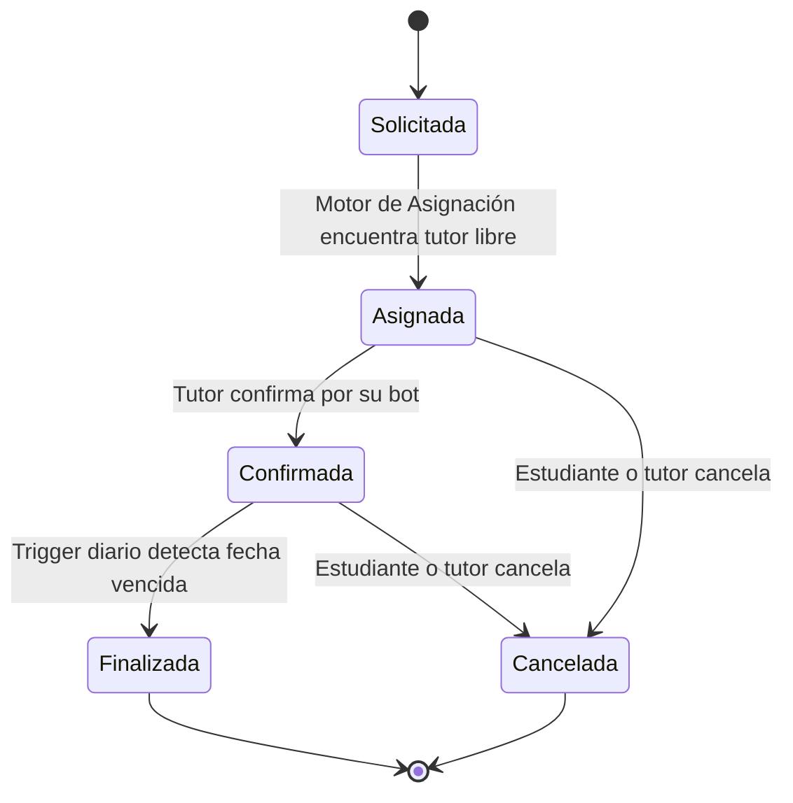
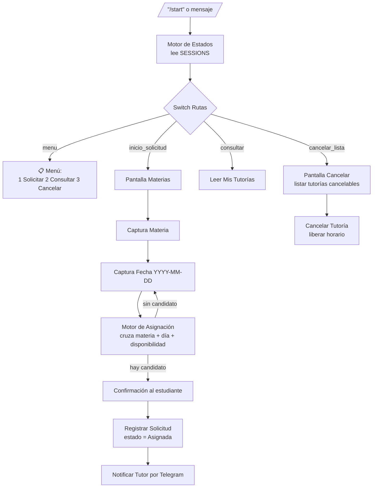
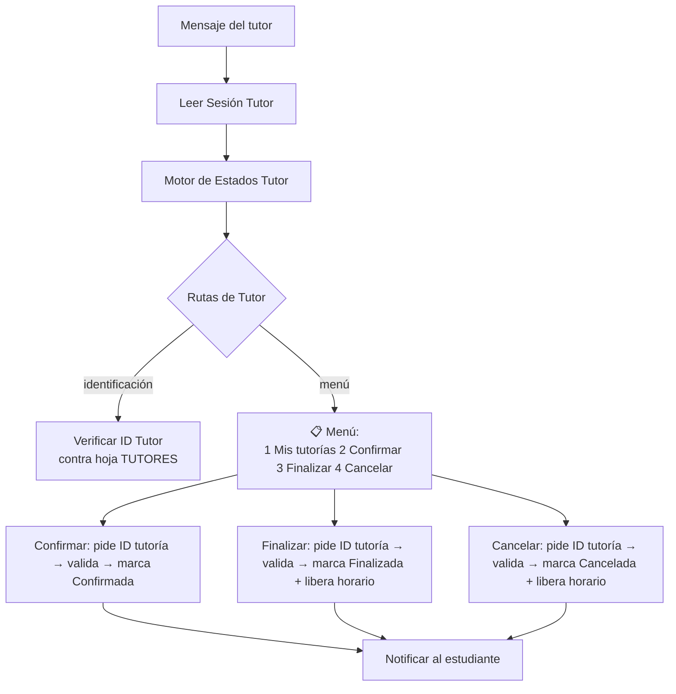

# 🤖 TutorBot — Sistema de Asesorías Académicas

Automatización construida en **n8n** que conecta estudiantes y tutores mediante
Telegram, usando **Google Sheets** como base de datos y un motor de asignación
que cruza materia + disponibilidad para eliminar la coordinación manual de
tutorías.

> Repositorio: `Proyecto_TutorBot_Anderson_Mariana

---

## 1. Descripción del proyecto

En la coordinación académica tradicional, estudiantes y tutores se organizan
por correo o mensajes informales, lo que genera cruces de horario, materias
desatendidas y cero trazabilidad. **TutorBot** automatiza todo el ciclo de
vida de una asesoría —solicitud, asignación, confirmación, recordatorio y
cierre— a través de dos bots de Telegram (uno para estudiantes y otro para
tutores) orquestados por n8n.

### Objetivos

- Integrar Telegram + Google Sheets + lógica de asignación en un solo flujo.
- Asociar automáticamente materia, tutor y horario libre.
- Ofrecer una interfaz conversacional para que el estudiante se autogestione
  (solicitar, consultar, cancelar).
- Controlar el estado de cada tutoría: `Solicitada → Asignada → Confirmada → Finalizada`
  (o `Cancelada`).
- Generar reportes automáticos para la coordinación académica.
- Validar disponibilidad en tiempo real y evitar doble reserva.

### Resultado esperado

| Meta | Descripción |
|---|---|
| ⏱️ -90% tiempo de asignación | El motor de asignación busca tutor + horario en segundos. |
| 🔍 Trazabilidad total | Toda tutoría queda registrada en `TUTORIAS` con estado y timestamps. |
| 📈 Escalabilidad | El modelo de datos soporta cientos de tutores/estudiantes sin cambios de lógica. |
| 🙂 Experiencia guiada | El estudiante nunca necesita manual: todo es menú numérico (wizard). |

---

## 2. Arquitectura del sistema



El sistema está compuesto por **2 flujos de n8n** (archivos incluidos en
[`/workflows`](./workflows)) que comparten la misma base de datos en Google
Sheets:

| Archivo | Rol | Disparadores |
|---|---|---|
| [`TutorBot_-_Reportes_y_Recordatorios.json`](./workflows/TutorBot_-_Reportes_y_Recordatorios.json) | **Portal del Estudiante** + motor de asignación + recordatorios + reporte semanal | Telegram Trigger (bot estudiante), Schedule Trigger diario 6:00 AM, Schedule Trigger semanal lunes 7:00 AM |
| [`TutorBot_-_Portal_Tutor.json`](./workflows/TutorBot_-_Portal_Tutor.json) | **Portal del Tutor**: confirmar / finalizar / cancelar tutorías validando su ID | Telegram Trigger (bot tutor) |

---

## 3. Modelo de datos (Google Sheets — `TutorBot_DB`)

| Hoja | Columnas | Uso |
|---|---|---|
| **TUTORES** | `id_tutor`, `nombre`, `especialidad_materias`, `estado` (Activo/Inactivo), `telegram_chat_id` | Catálogo de tutores y materias que dictan. |
| **DISPONIBILIDAD** | `id_dispo`, `id_tutor`, `dia_semana`, `hora_inicio`, `hora_fin`, `estado` (Libre/Ocupado) | Agenda semanal recurrente de cada tutor. |
| **TUTORIAS** | `id_tutoria`, `id_estudiante`, `id_tutor`, `materia`, `fecha`, `hora`, `estado`, `id_dispo` | Registro histórico de cada asesoría (trazabilidad). |
| **SESSIONS** | `telegram_user`, `pantalla_actual`, `paso_actual`, `datos_parciales` | Estado del wizard del **estudiante** (multi-paso). |
| **SESSIONS_TUTOR** | `telegram_user`, `pantalla_actual`, `paso_actual`, `datos_parciales` | Estado del wizard del **tutor**. |

> Los IDs de la hoja de cálculo (`documentId`) y de las hojas quedaron
> preconfigurados con la credencial de Google Sheets del autor original.
> **Debes reemplazarlos por tu propio Spreadsheet ID** al importar los flujos
> (ver sección 5).

### Máquina de estados de una tutoría



---

## 4. Flujos guiados (Wizard)

### 4.1 Portal del Estudiante — `TutorBot_-_Reportes_y_Recordatorios.json`



Pasos del flujo **"Solicitar Tutoría"**:

1. **Materia** – el bot muestra las materias disponibles (según tutores activos).
2. **Fecha** – el usuario ingresa la fecha en formato `YYYY-MM-DD`.
3. **Búsqueda** – el *Motor de Asignación* cruza materia + día de la semana +
   franja `Libre` en `DISPONIBILIDAD`.
4. **Confirmación** – el usuario confirma el tutor y horario sugerido.
5. **Notificación** – la tutoría se registra como `Asignada` en `TUTORIAS` y
   se notifica al tutor por su bot.

### 4.2 Recordatorios y reportes automáticos (mismo archivo)

- **Trigger diario 6:00 AM** → `Generar Tareas Diarias`: envía recordatorio a
  estudiante y tutor si la tutoría es hoy (`Asignada`/`Confirmada`), y marca
  para finalizar las tutorías cuya fecha ya venció.
- **Trigger semanal (lunes 7:00 AM)** → `Generar Reporte Semanal`: cuenta las
  tutorías de los últimos 7 días por estado, materia y tutor, y envía el
  resumen a la coordinación académica por Telegram.

> ⚠️ En el nodo `Generar Reporte Semanal` reemplaza la constante
> `COORDINADOR_CHAT_ID = 'PON_AQUI_EL_CHAT_ID_DEL_COORDINADOR'` por el
> `chat_id` real de la persona/canal que recibirá el reporte.

### 4.3 Portal del Tutor — `TutorBot_-_Portal_Tutor.json`



El tutor primero se identifica con su `id_tutor` (validado contra la hoja
`TUTORES`); una vez identificado, cada acción (confirmar / finalizar /
cancelar) pide el `id_tutoria`, valida que pertenezca a ese tutor y actualiza
el estado correspondiente en `TUTORIAS`, liberando el slot en
`DISPONIBILIDAD` cuando aplica.

---

## 5. Instalación y configuración

### 5.1 Requisitos

- Instancia de **n8n** (Cloud o self-hosted) ≥ 1.4x.
- Dos bots de Telegram creados con [@BotFather](https://t.me/BotFather):
  uno para **estudiantes** y otro para **tutores** (obtén el `Bot Token` de
  cada uno).
- Una hoja de cálculo de **Google Sheets** llamada `TutorBot_DB` con las 5
  hojas descritas en la sección 3 (encabezados exactos en la primera fila).
- Cuenta de Google con credencial **OAuth2** habilitada para la API de
  Google Sheets.

### 5.2 Pasos

1. **Crear la base de datos**: duplica/crea `TutorBot_DB` en Google Sheets
   con las hojas `TUTORES`, `DISPONIBILIDAD`, `TUTORIAS`, `SESSIONS` y
   `SESSIONS_TUTOR`, usando las columnas de la sección 3.
2. **Importar los flujos** en n8n:
   `Workflows → Import from File` y selecciona cada `.json` de
   [`/workflows`](./workflows).
3. **Configurar credenciales**:
   - En cada nodo `Telegram Trigger` / `Telegram`, asigna la credencial
     `Telegram API` correspondiente (bot de estudiante en
     *Reportes y Recordatorios*, bot de tutor en *Portal Tutor*).
   - En cada nodo `Google Sheets`, asigna tu credencial
     `Google Sheets OAuth2` y actualiza el `documentId` para que apunte a tu
     copia de `TutorBot_DB`.
4. **Actualizar el `chat_id` del coordinador** en el nodo
   `Generar Reporte Semanal` (ver nota en 4.2).
5. **Activar ambos workflows** (toggle *Active* en la esquina superior).
6. **Configurar el webhook de Telegram**: al activar el workflow, n8n
   registra automáticamente el webhook del `Telegram Trigger`; verifica con
   `https://api.telegram.org/bot<token>/getWebhookInfo`.
7. **Probar**: escribe `/start` a cada bot y recorre el wizard completo
   (solicitar → confirmar → finalizar) verificando que `TUTORIAS` y
   `DISPONIBILIDAD` se actualicen correctamente.

### 5.3 Capturas del flujo

> 📸 Agrega aquí las capturas de pantalla del **canvas de n8n** (ambos
> workflows) y de una conversación real de Telegram probando el wizard, por
> ejemplo en `docs/capturas/`. Los diagramas de esta sección (Mermaid) sirven
> como referencia de la lógica mientras se agregan las capturas reales.

```
docs/
└── capturas/
    ├── canvas-portal-estudiante.png
    ├── canvas-portal-tutor.png
    ├── telegram-solicitar-tutoria.png
    └── telegram-confirmar-tutor.png
```

---

## 6. Estructura del repositorio

```
Proyecto_TutorBot_ApellidoNombre/
├── README.md
├── workflows/
│   ├── TutorBot_-_Reportes_y_Recordatorios.json   # Portal estudiante + reportes + recordatorios
│   └── TutorBot_-_Portal_Tutor.json               # Portal tutor
└── docs/
    └── capturas/                                   # Screenshots del canvas y del bot
```

---

## 7. Link de Sheets

(https://docs.google.com/spreadsheets/d/1HHuLoi-cLJtpQ9evuGu0qHDU9dBfRi_6eZsmCtnF2yk/edit?usp=sharing)


---
